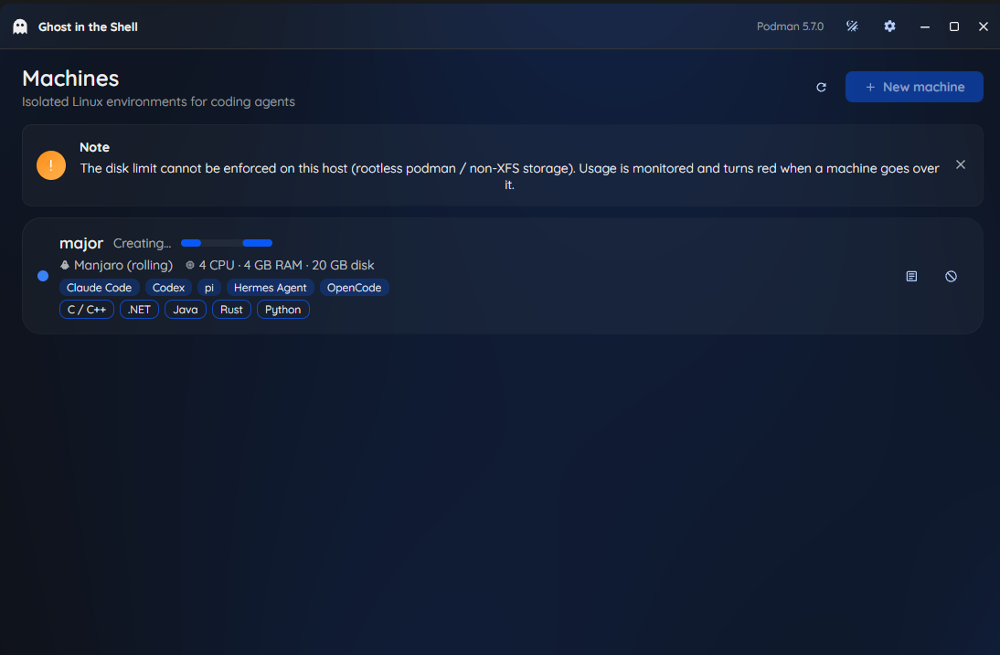

# Ghost in the Shell

A desktop manager for creating, starting, stopping, deleting and opening terminals into isolated Linux sandboxes (Ubuntu, Fedora or Manjaro) with coding agents preinstalled (Claude Code, pi, Hermes, OpenCode). You set the CPU, memory and disk for each sandbox.

Built with [Avalonia 12](https://avaloniaui.net/) and [SukiUI](https://github.com/kikipoulet/SukiUI). The machines run as rootless [Podman](https://podman.io/) containers.



## Features

- **Create a machine**: pick a name, Linux distribution, CPU cores, memory, disk size and the coding agents to install. The build log streams into the machine's card, and you can cancel the build.
- **Start / stop / delete**: deleting asks for confirmation and removes the machine together with its home volume.
- **Open a terminal**: opens a login shell as the `agent` user in your terminal emulator (Ptyxis, GNOME Terminal, Konsole, kitty, Alacritty, Ghostty, WezTerm, xterm, and others).
- **Live status**: the list follows `podman events`, so it also picks up changes you make with the `podman` CLI.
- **Disk usage**: shows the space each machine uses against its limit, and turns red when a machine goes over it.
- **Light and dark theme**.


### Supported distributions

| ID | Image |
|---|---|
| `ubuntu-24.04` | `docker.io/library/ubuntu:24.04` |
| `ubuntu-26.04` | `docker.io/library/ubuntu:26.04` |
| `fedora-43` | `registry.fedoraproject.org/fedora:43` |
| `manjaro` | `docker.io/manjarolinux/base:latest` |

### Supported agents

| Agent | Installed with |
|---|---|
| [Claude Code](https://claude.com/claude-code) | `curl -fsSL https://claude.ai/install.sh \| bash` |
| [pi](https://pi.dev) | `npm install -g @earendil-works/pi-coding-agent` |
| [Hermes Agent](https://github.com/NousResearch/hermes-agent) | official install script (`--non-interactive`) |
| [OpenCode](https://opencode.ai) | `curl -fsSL https://opencode.ai/install \| bash` |

Every machine gets Node.js 24 LTS, git, Python 3, build tools, and a passwordless-sudo `agent` user.

## Requirements

- Linux
- [.NET 10 SDK](https://dotnet.microsoft.com/download)
- Podman (rootless works): `sudo apt install podman` / `sudo dnf install podman`

## Getting started

```bash
git clone <repo-url>
cd GhostInTheShell
dotnet run --project src/GhostInTheShell.App
```

Run the tests:

```bash
dotnet test
```

The first machine for a given distro and agent combination takes a few minutes to build. Later machines with the same selection reuse the cached image and start in seconds.

## How it works

1. **Image**: the chosen distro and agents become a Containerfile (`ContainerfileBuilder`). Each agent gets its own layer. The image is tagged by the Containerfile's content hash (`localhost/gits/<os>:<hash>`), so the same selection reuses the image, and any catalog change triggers a rebuild.
2. **Machine**: a container named `gits-<name>` with `--cpus`, `--memory`, `--init`, and a named volume `gits-<name>-home` mounted at `/home/agent`. Podman copies the image's home directory into the empty volume, so installed agents and your files survive stop, start and image updates.
3. **State**: there is no database. Each machine's settings are stored as `gits.*` labels on its container, and the app reads them back with `podman ps`.
4. **Terminal**: `podman exec -it -u agent -w /home/agent gits-<name> bash -l`, placed into a terminal command template.

### Disk limits

Podman can only enforce the disk size (`--storage-opt size=`) with the overlay driver on XFS with project quotas, running as root. The app tries it first. If Podman rejects it, which is the usual case for rootless setups, the app creates the machine without it and only reports the disk usage. A banner in the app says which mode is active.

## Configuration

Files live in `~/.config/ghostintheshell/`:

| File | Purpose |
|---|---|
| `settings.json` | terminal command template and theme (editable from **Settings** in the app) |
| `catalog.json` | *optional*: replaces the built-in distro and agent catalog |

### Terminal template

`{cmd}` is replaced with the shell command, for example:

```
ptyxis --new-window -- {cmd}
gnome-terminal -- {cmd}
kitty {cmd}
```

On first run the app picks the first terminal it finds on your `PATH`.

### Custom catalog

Install scripts change. To fix or extend them without rebuilding the app, copy [`src/GhostInTheShell.Core/catalog.json`](src/GhostInTheShell.Core/catalog.json) to `~/.config/ghostintheshell/catalog.json` and edit it:

```jsonc
{
  "operatingSystems": [
    { "id": "debian-13", "displayName": "Debian 13", "image": "docker.io/library/debian:13",
      "setup": "apt-get update && apt-get install -y curl git sudo ..." }
  ],
  "commonSetup": [ "..." ],               // root commands run on every distro (Node.js install)
  "agents": [
    { "id": "myagent", "displayName": "My Agent", "description": "...",
      "install": "curl -fsSL https://example.com/install.sh | bash",   // runs as the agent user
      "check": "myagent --version" }                                    // fails the build if the install broke
  ],
  "userPath": [ "/home/agent/.local/bin" ]
}
```

## Project layout

```
src/
  GhostInTheShell.Core/     models, IVmProvider, catalog, Containerfile generation (no UI)
  GhostInTheShell.Podman/   PodmanProvider — drives the podman CLI
  GhostInTheShell.App/      Avalonia + SukiUI desktop app (MVVM, CommunityToolkit.Mvvm)
tests/
  GhostInTheShell.Tests/    xUnit tests
```

All backend calls go through `IVmProvider`, so you can add another backend (QEMU/KVM, VirtualBox, Incus) as a new provider without changing the UI.

## Security notes

- The machines are **containers, not VMs**: they share the host kernel. Rootless Podman keeps them isolated from your user account, but they don't give you the isolation of a hypervisor.
- The `agent` user has passwordless sudo **inside** the container.
- Agent install scripts are downloaded from their vendors and run at build time. Review `catalog.json` if that matters to you.
